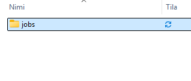
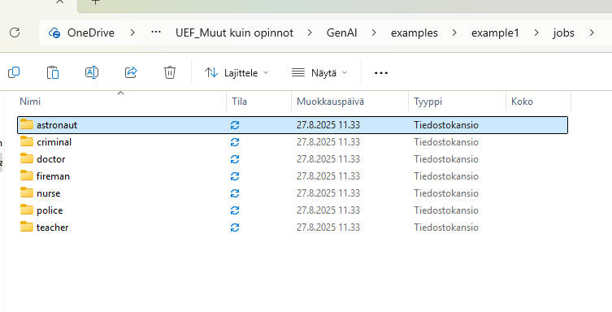
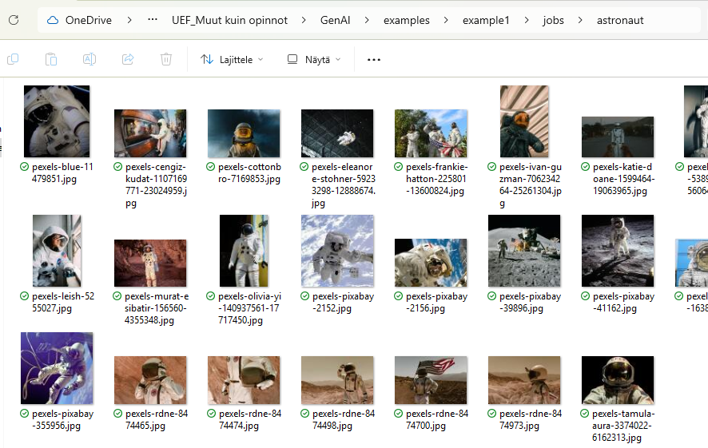
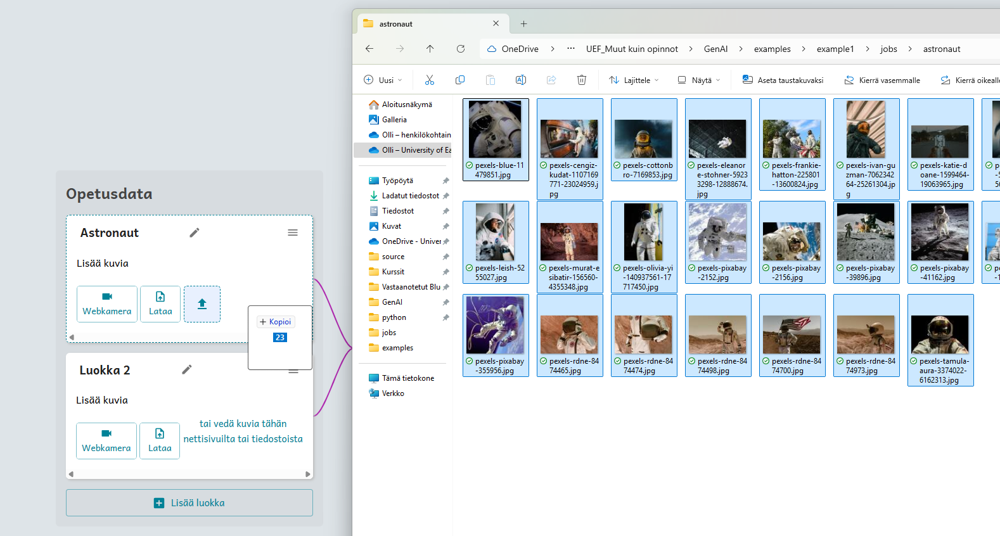
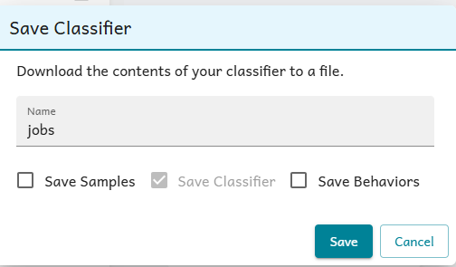
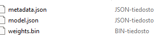
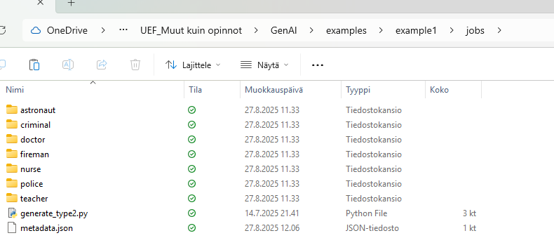
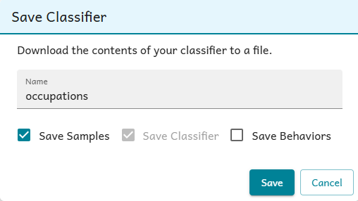
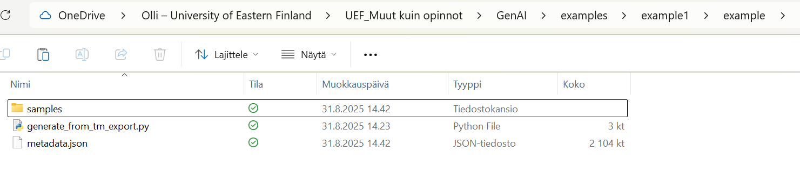

# How to add new models to Breakable Machine

This readme-file goes trough the process of adding new model to the game
 

These scripts will create thumbnail pictures and json-files. Also generate_type2.py will alter resolution of original pictures to have max 512px width and height.
 
If you want to keep original pictures, make copy of them to different location before executing script.
 

There is two different scripts in this scripts folder:

-   generate_type2.py
-   generate_from_tm_export.py

 

## Generating new model (with generate_type2.py)

 
Generating model in this way will result on max 512px sized preview pictures. Generating with generate_from_tm_export.py will have lower resolution of 224px * 224px.

<em>In this example we will be creating new model called 'jobs'.
 
The model will include seven labels</em>

1. Make root folder for your new model (small letters). Name of the folder should be same as the model name will be. (picture 1)

 <em>picture 1</em>

2. Inside the root folder, create folders for each label (small letters again) (picture 2)  
   Please name them in English (default language)

 <em>picture 2</em>

3. Find pictures for each label and place pictures in their folders (picture 3)

 <em>picture 3</em>

4. Make a model with https://tm.gen-ai.fi/image/general
 
You can drag and drop images from their folders. (picture 4)
  
 Here the word can be capitalized (if you like them to be in game capitalized).
 

 <em>picture 4</em>

5. Save the model (no behaviors or samples). Use same name that you used as a root folder.

 <em>picture 5</em>

6. Prepare for script execution

 

 Do not alter the saved zip file any way. It should contain three files:
 
 

  
 Make a <b>copy</b> of that metadata.json and place that inside the root folder.
 (picture 6)

  
 Also make a <b>copy</b> of generate_type2.py script (located at the same folder as this readme) and place that also to root folder. (picture 6)
 

 <em>picture 6</em>

7. Run the script (by double click) (assuming you have python installed)

<em>Script may take few minutes to run. It will resize every picture that is over 512px height or width</em>

8. Do translations

Script creates translation file for en-GB.
Do needed translations for other languages

9. Delete metadata.json and generate_type2.py from root folder

## Generating new model (generate_from_tm_export.py)

<em>In this example we will be creating new model called 'occupations'.
 
The model will include two labels</em>

1. Create root folder, name of the folder doesn't matter

2. Make a model with https://tm.gen-ai.fi/image/general

-   Save also the samples!

3.  Prepare for script execution

        <em>
        Saved zip-file should contain:

        - folder "samples"
        - metadata.json
        - model.json
        - weights.bin
          </em>

    W

-   Copy metadata.json file to root folder
-   Cut samples folder to root folder (copy and remove from zip-file)
-   Copy generate_from_tm_export.py to root folder

4. Run script

Script should run pretty fast.

<em> If script fails (e.g. nothing happens), make sure the metadata.json file is readable actual text with notepad. If it is not, copy it again. </em>

5. Do translations

Script creates translation file for en-GB.
Do the required translations for other languages

6. Delete samples folder if exists (might get removed automatically and should be empty)
